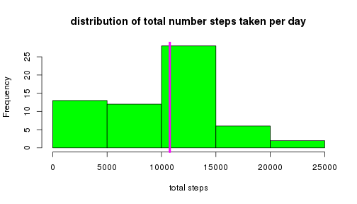
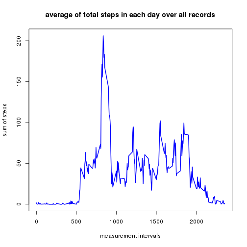
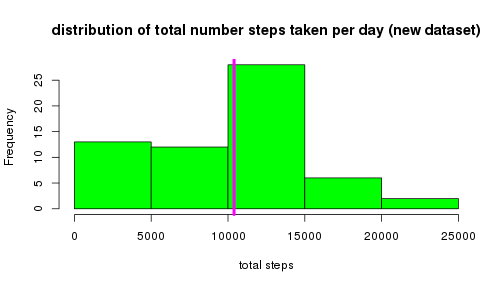
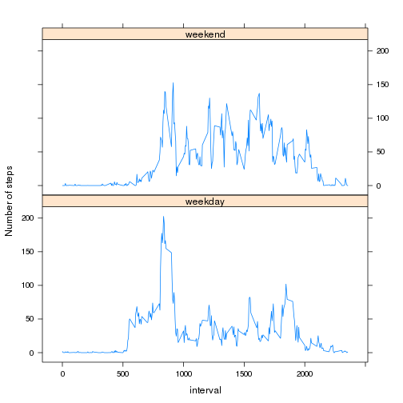

PA1 - RepData
========================================================

This report makes use of data from a personal activity monitoring device. 
This device collects data at 5 minute intervals through out the day. 

The data consists of two months of data from an anonymous individual collected during the months of October and November, 2012 and include the number of steps taken in 5 minute intervals each day.

## load data and do exploratory analysis


```r
activity <- read.csv('activity.csv')
```

We have 3 columns in this record (names = steps, date, interval), the total record is 17568. A quick exploration could reveals,


```r
summary(activity$date)
```

```
## 2012-10-01 2012-10-02 2012-10-03 2012-10-04 2012-10-05 2012-10-06 
##        288        288        288        288        288        288 
## 2012-10-07 2012-10-08 2012-10-09 2012-10-10 2012-10-11 2012-10-12 
##        288        288        288        288        288        288 
## 2012-10-13 2012-10-14 2012-10-15 2012-10-16 2012-10-17 2012-10-18 
##        288        288        288        288        288        288 
## 2012-10-19 2012-10-20 2012-10-21 2012-10-22 2012-10-23 2012-10-24 
##        288        288        288        288        288        288 
## 2012-10-25 2012-10-26 2012-10-27 2012-10-28 2012-10-29 2012-10-30 
##        288        288        288        288        288        288 
## 2012-10-31 2012-11-01 2012-11-02 2012-11-03 2012-11-04 2012-11-05 
##        288        288        288        288        288        288 
## 2012-11-06 2012-11-07 2012-11-08 2012-11-09 2012-11-10 2012-11-11 
##        288        288        288        288        288        288 
## 2012-11-12 2012-11-13 2012-11-14 2012-11-15 2012-11-16 2012-11-17 
##        288        288        288        288        288        288 
## 2012-11-18 2012-11-19 2012-11-20 2012-11-21 2012-11-22 2012-11-23 
##        288        288        288        288        288        288 
## 2012-11-24 2012-11-25 2012-11-26 2012-11-27 2012-11-28 2012-11-29 
##        288        288        288        288        288        288 
## 2012-11-30 
##        288
```

```r
summary(activity$steps)
```

```
##    Min. 1st Qu.  Median    Mean 3rd Qu.    Max.    NA's 
##    0.00    0.00    0.00   37.38   12.00  806.00    2304
```

```r
str(activity$interval)
```

```
##  int [1:17568] 0 5 10 15 20 25 30 35 40 45 ...
```

Thus one may know there are many missing record (sum of them = 2304).

Now, let's split the data by its date


```r
splitSet <- split(activity, activity$date)
```

and we know we have 61 subset divided by date, and each set is data.frame, so we can do exploratory analysis like the looking into the total number of steps taken per day,


```r
sumStep = c()
for (i in 1:length(names(splitSet))) {
    sumStep[i] <- sum(splitSet[[i]]$steps, na.rm=T)
}
hist(sumStep, col = "green",
     main='distribution of total number steps taken per day',
     xlab='total steps')
abline(v = median(sumStep[sumStep > 0]), col = "magenta", lwd = 4)
```

 

take of those days without any measurement on steps, we can further get the mean = 1.0766189 &times; 10<sup>4</sup> and median = 10765

if we look at the pattern of data along with the different time in each day, we need to split it by intervals (now we use apply to concise the operation),


```r
splitSet2 <- split(activity$steps, activity$interval)
avgStepsT <- sapply(splitSet2, mean, na.rm=T)
plot(names(splitSet2),avgStepsT, type='l', col='blue', lwd=2,
     main='average of total steps in each day over all records',
     xlab='measurement intervals', ylab='sum of steps')
```

 

now we can see during interval 835, the object usually have a intense activity.

## investigate the influence from missing data

As we known, about 2304 (13.1147541%) records are missing. So a reasonable suspicision is projected that is these missing data could somehow introduce the bias to the calculation result.

If we substitute the missing data with the result of mean filtering (3 points), we will get a new dataset 


```r
activityNew <- data.frame(steps=c(), date=factor(), interval=c())
for (i in 1:length(names(splitSet))) {
    for (j in 1:nrow(splitSet[[i]])) {
        
        if (is.na(splitSet[[i]]$steps[j])) {
            if (j == 1 || j == nrow(splitSet[[i]])) {
                splitSet[[i]]$steps[j] <- 0
            } else {
                if (is.na(splitSet[[i]]$steps[j+1])) {
                    splitSet[[i]]$steps[j] <- splitSet[[i]]$steps[j-1]
                } else {
                    splitSet[[i]]$steps[j] <- 
                        (splitSet[[i]]$steps[j-1] + splitSet[[i]]$steps[j+1])/2
                }
            }
        }
    }
    
    activityNew <- rbind(activityNew, splitSet[[i]])
}
summary(activityNew)
```

```
##      steps                date          interval     
##  Min.   :  0.00   2012-10-01:  288   Min.   :   0.0  
##  1st Qu.:  0.00   2012-10-02:  288   1st Qu.: 588.8  
##  Median :  0.00   2012-10-03:  288   Median :1177.5  
##  Mean   : 32.48   2012-10-04:  288   Mean   :1177.5  
##  3rd Qu.:  0.00   2012-10-05:  288   3rd Qu.:1766.2  
##  Max.   :806.00   2012-10-06:  288   Max.   :2355.0  
##                   (Other)   :15840
```

now we recalculate the mean and median


```r
splitSet3 <- split(activityNew$steps, activityNew$date)
sumStep <- sapply(splitSet3, sum)
hist(sumStep, col = "green",
     main='distribution of total number steps taken per day (new dataset)',
     xlab='total steps')
abline(v = median(sumStep), col = "magenta", lwd = 4)
```

 

and they are 9354.2295082 and 1.0395 &times; 10<sup>4</sup>, both become smaller comparing the previous result.

## investigate the pattern between weekdays and weedend

firstly, let's add an extra variable to the new dataset. A factor indicate if the measurement day is a weekday.


```r
dateType <- weekdays(as.POSIXlt(activityNew$date))
activityNew$dayType <- as.factor(ifelse((dateType == "Saturday") | (dateType == "Sunday"), "Weekend", "Weekdays"))
```

and then we try to investigate the average steps patterns in these two groups.


```r
library(lattice)

splitSet4 <- split(activityNew, activityNew$dayType)
splitSet41 <- split(splitSet4$Weekdays$steps, splitSet4$Weekdays$interval)
splitSet42 <- split(splitSet4$Weekend$steps, splitSet4$Weekend$interval)
weekdayAvg <- sapply(splitSet41, mean)
weekendAvg <- sapply(splitSet42, mean)
intervals <- unique(activity$interval)
plotData <- data.frame(
    avg = c(weekdayAvg, weekendAvg), 
    interval = c(intervals, 
                 intervals), 
    dayType = c(
        rep('weekday',length(intervals)),
        rep('weekend',length(intervals))
        )
    )

xyplot(avg ~ interval|factor(dayType),
       data = plotData,
       layout = c(1, 2),
       ylab = "Number of steps", xlab = "interval",
       type=c("l"),
       )
```

 

